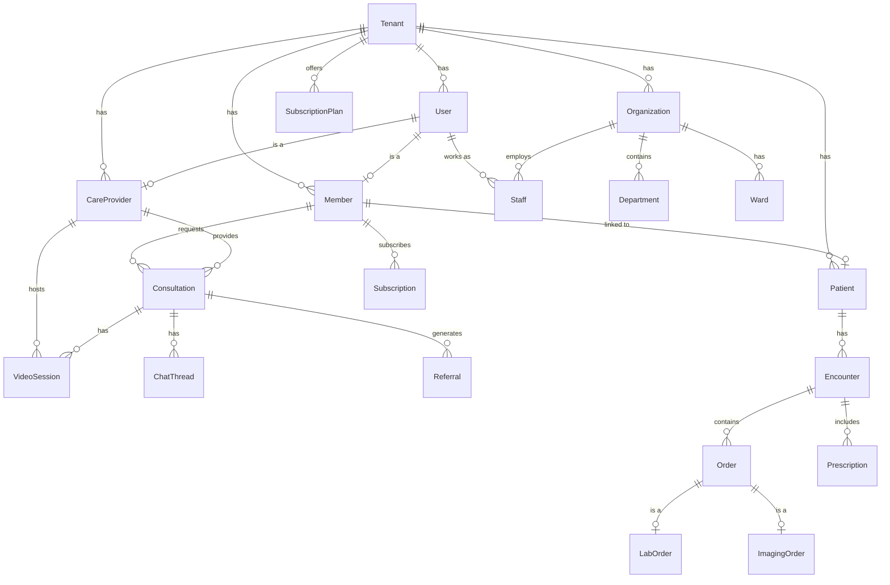

# VardMD Database Schema Documentation

> **Database**: PostgreSQL  
> **ORM**: Prisma  
> **Last Updated**: January 4, 2026

---

## Table of Contents

1. [Overview](#overview)
2. [Entity Relationship Diagram](#entity-relationship-diagram)
3. [Core Entities](#core-entities)
4. [Subscription & Billing](#subscription--billing)
5. [Care Providers](#care-providers)
6. [Consultations & Video Sessions](#consultations--video-sessions)
7. [Chat System](#chat-system)
8. [Patient Management](#patient-management)
9. [Clinical Encounters](#clinical-encounters)
10. [Lab & Imaging](#lab--imaging)
11. [Pharmacy & Prescriptions](#pharmacy--prescriptions)
12. [Hospital Admissions](#hospital-admissions)
13. [Organization Structure](#organization-structure)
14. [Notifications & Audit](#notifications--audit)
15. [Enums Reference](#enums-reference)

---

## Overview

VardMD uses a multi-tenant architecture where all data is scoped to a **Tenant**. The system supports:

- **Telemedicine** (virtual consultations, video sessions, chat)
- **EMR** (Electronic Medical Records with encounters, diagnoses, clinical notes)
- **Lab & Imaging** (order management and results)
- **Pharmacy** (formulary, inventory, prescriptions, dispensing)
- **Hospital Operations** (wards, beds, admissions, transfers)

---

## Entity Relationship Diagram



---

## Core Entities

### Tenant

Multi-tenant root entity. All data is scoped by tenant.

| Column       | Type     | Description              |
| ------------ | -------- | ------------------------ |
| `id`         | UUID     | Primary key              |
| `name`       | String   | Tenant name              |
| `domain`     | String   | Unique domain identifier |
| `created_at` | DateTime | Creation timestamp       |
| `updated_at` | DateTime | Last update timestamp    |

**Table Name**: `tenants`

---

### User

All system users including admins, providers, staff, and members.

| Column                     | Type      | Description                           |
| -------------------------- | --------- | ------------------------------------- |
| `id`                       | UUID      | Primary key                           |
| `tenant_id`                | UUID      | FK to Tenant                          |
| `email`                    | String    | Unique email address                  |
| `phone`                    | String?   | Phone number                          |
| `password_hash`            | String    | Hashed password                       |
| `first_name`               | String    | First name                            |
| `last_name`                | String    | Last name                             |
| `role`                     | UserRole  | User's role in the system             |
| `is_active`                | Boolean   | Account active status                 |
| `is_verified`              | Boolean   | Verification status                   |
| `email_verified`           | Boolean   | Email verified flag                   |
| `phone_verified`           | Boolean   | Phone verified flag                   |
| `two_factor_enabled`       | Boolean   | 2FA enabled                           |
| `mfa_secret`               | String?   | MFA secret key                        |
| `last_password_change`     | DateTime? | Last password change date             |
| `failed_login_attempts`    | Int       | Failed login counter                  |
| `locked_until`             | DateTime? | Account lock expiry                   |
| `profile_picture`          | String?   | Profile image URL                     |
| `timezone`                 | String    | User timezone (default: Africa/Lagos) |
| `language`                 | String    | Preferred language (default: en)      |
| `last_login_at`            | DateTime? | Last login timestamp                  |
| `last_login_ip`            | String?   | Last login IP address                 |
| `refresh_token`            | String?   | JWT refresh token                     |
| `otp`                      | String?   | One-time password                     |
| `otpExpires`               | DateTime? | OTP expiry time                       |
| `gender`                   | String?   | Gender                                |
| `city`                     | String?   | City                                  |
| `state`                    | String?   | State                                 |
| `country`                  | String?   | Country                               |
| `allergies`                | String?   | Known allergies                       |
| `conditions`               | String?   | Medical conditions                    |
| `blood_group`              | String?   | Blood group                           |
| `preferred_language`       | String?   | Preferred language                    |
| `communication_preference` | String?   | Communication preference              |
| `dob`                      | String?   | Date of birth                         |
| `is_online`                | Boolean   | Online status                         |
| `last_seen`                | DateTime? | Last seen timestamp                   |
| `presence_status`          | String    | Presence status (default: offline)    |
| `source`                   | String?   | Registration source (default: WEB)    |
| `resetPasswordToken`       | String?   | Password reset token                  |
| `resetTokenExpiry`         | DateTime? | Reset token expiry                    |
| `created_at`               | DateTime  | Creation timestamp                    |
| `updated_at`               | DateTime  | Last update timestamp                 |

**Table Name**: `users`  
**Indexes**: `tenant_id`, `email`, `role`

---

### Member

Telemedicine members (patients using the virtual care platform).

| Column              | Type      | Description                |
| ------------------- | --------- | -------------------------- |
| `id`                | UUID      | Primary key                |
| `tenant_id`         | UUID      | FK to Tenant               |
| `user_id`           | UUID      | FK to User (unique)        |
| `date_of_birth`     | DateTime? | Date of birth              |
| `sex`               | Sex?      | Gender enum                |
| `id_type`           | IdType?   | ID document type           |
| `id_number`         | String?   | ID document number         |
| `address`           | String?   | Street address             |
| `city`              | String?   | City                       |
| `state`             | String?   | State                      |
| `country`           | String?   | Country (default: Nigeria) |
| `emergency_contact` | JSON?     | Emergency contact details  |
| `created_at`        | DateTime  | Creation timestamp         |
| `updated_at`        | DateTime  | Last update timestamp      |

**Table Name**: `members`  
**Indexes**: `tenant_id`, `user_id`

---

## Subscription & Billing

### SubscriptionPlan

Available subscription plans for members and organizations.

| Column                      | Type              | Description                  |
| --------------------------- | ----------------- | ---------------------------- |
| `id`                        | UUID              | Primary key                  |
| `tenant_id`                 | UUID              | FK to Tenant                 |
| `name`                      | String            | Plan name                    |
| `scope`                     | SubscriptionScope | TELEMEMBER or FACILITY       |
| `price_cents`               | Int               | Price in cents/kobo          |
| `currency`                  | Char(3)           | Currency code (default: NGN) |
| `billing_cycle_months`      | Int               | Billing cycle in months      |
| `consultations_per_month`   | Int?              | Monthly consultation limit   |
| `contacts_per_consultation` | Int?              | Contacts per consultation    |
| `max_staff`                 | Int?              | Maximum staff allowed        |
| `max_locations`             | Int?              | Maximum locations allowed    |
| `features`                  | JSON?             | Additional features          |
| `is_active`                 | Boolean           | Plan active status           |
| `created_at`                | DateTime          | Creation timestamp           |
| `updated_at`                | DateTime          | Last update timestamp        |

**Table Name**: `subscription_plans`

---

### Subscription

Active subscriptions linking members/organizations to plans.

| Column            | Type      | Description                            |
| ----------------- | --------- | -------------------------------------- |
| `id`              | UUID      | Primary key                            |
| `tenant_id`       | UUID      | FK to Tenant                           |
| `plan_id`         | UUID      | FK to SubscriptionPlan                 |
| `member_id`       | UUID?     | FK to Member (for individual subs)     |
| `organization_id` | UUID?     | FK to Organization (for facility subs) |
| `start_date`      | DateTime? | Subscription start date                |
| `end_date`        | DateTime? | Subscription end date                  |
| `auto_renew`      | Boolean   | Auto-renewal enabled                   |
| `status`          | String    | Subscription status                    |
| `created_at`      | DateTime  | Creation timestamp                     |
| `updated_at`      | DateTime  | Last update timestamp                  |

**Table Name**: `subscriptions`

---

### BillingInvoice

Invoices generated for subscriptions.

| Column            | Type          | Description                  |
| ----------------- | ------------- | ---------------------------- |
| `id`              | UUID          | Primary key                  |
| `tenant_id`       | UUID          | FK to Tenant                 |
| `subscription_id` | UUID          | FK to Subscription           |
| `amount_cents`    | Int           | Invoice amount in cents      |
| `currency`        | Char(3)       | Currency code (default: NGN) |
| `due_date`        | DateTime      | Payment due date             |
| `status`          | PaymentStatus | Invoice payment status       |
| `metadata`        | JSON?         | Additional metadata          |
| `created_at`      | DateTime      | Creation timestamp           |
| `updated_at`      | DateTime      | Last update timestamp        |

**Table Name**: `billing_invoices`

---

### BillingPayment

Payments made against invoices.

| Column         | Type      | Description                  |
| -------------- | --------- | ---------------------------- |
| `id`           | UUID      | Primary key                  |
| `invoice_id`   | UUID      | FK to BillingInvoice         |
| `amount_cents` | Int       | Payment amount in cents      |
| `currency`     | Char(3)   | Currency code (default: NGN) |
| `paid_at`      | DateTime? | Payment timestamp            |
| `provider`     | String?   | Payment provider name        |
| `provider_ref` | String?   | Payment provider reference   |
| `created_at`   | DateTime  | Creation timestamp           |
| `updated_at`   | DateTime  | Last update timestamp        |

**Table Name**: `billing_payments`

---

## Care Providers

### CareProvider

Healthcare providers (doctors, nurses, specialists).

| Column             | Type           | Description                  |
| ------------------ | -------------- | ---------------------------- |
| `id`               | UUID           | Primary key                  |
| `tenant_id`        | UUID           | FK to Tenant                 |
| `user_id`          | UUID           | FK to User (unique)          |
| `profession`       | String         | Professional title           |
| `specialties`      | String?        | Medical specialties          |
| `license_no`       | String?        | License number               |
| `license_country`  | String?        | License issuing country      |
| `years_experience` | Int?           | Years of experience          |
| `status`           | ProviderStatus | Provider verification status |
| `bio`              | String?        | Provider biography           |
| `rating`           | Decimal(3,2)?  | Average rating               |
| `created_at`       | DateTime       | Creation timestamp           |
| `updated_at`       | DateTime       | Last update timestamp        |

**Table Name**: `care_providers`  
**Indexes**: `tenant_id`, `user_id`

---

### ProviderAvailability

Provider availability schedule.

| Column           | Type               | Description           |
| ---------------- | ------------------ | --------------------- |
| `id`             | UUID               | Primary key           |
| `provider_id`    | UUID               | FK to CareProvider    |
| `status`         | AvailabilityStatus | ON or OFF             |
| `tz`             | String             | Timezone              |
| `weekday`        | Int                | Day of week (0-6)     |
| `start_time`     | String             | Start time (HH:MM)    |
| `end_time`       | String             | End time (HH:MM)      |
| `effective_from` | DateTime?          | Schedule start date   |
| `effective_to`   | DateTime?          | Schedule end date     |
| `created_at`     | DateTime           | Creation timestamp    |
| `updated_at`     | DateTime           | Last update timestamp |

**Table Name**: `provider_availability`

---

## Consultations & Video Sessions

### Consultation

Telemedicine consultations between members and providers.

| Column                 | Type           | Description                 |
| ---------------------- | -------------- | --------------------------- |
| `id`                   | UUID           | Primary key                 |
| `tenant_id`            | UUID           | FK to Tenant                |
| `member_id`            | UUID           | FK to Member                |
| `provider_id`          | UUID           | FK to CareProvider          |
| `subscription_id`      | UUID?          | FK to Subscription          |
| `started_at`           | DateTime?      | Consultation start time     |
| `closed_at`            | DateTime?      | Consultation end time       |
| `status`               | String         | Consultation status         |
| `reason`               | String?        | Reason for consultation     |
| `notes`                | String?        | General notes               |
| `consultation_type`    | String?        | Type of consultation        |
| `provider_type`        | String?        | Type of provider            |
| `amount`               | Decimal(10,2)? | Consultation fee            |
| `currency`             | Char(3)        | Currency (default: NGN)     |
| `encounter_notes`      | String?        | Clinical encounter notes    |
| `followup_date`        | DateTime?      | Follow-up date              |
| `followup_required`    | Boolean        | Follow-up needed flag       |
| `lab_results`          | JSON?          | Lab results data            |
| `prescriptions`        | JSON?          | Prescription data           |
| `requested_time`       | DateTime?      | Requested consultation time |
| `reschedule_requested` | Boolean        | Reschedule flag             |
| `audio_call`           | Boolean        | Audio call included         |
| `video_call`           | Boolean        | Video call included         |
| `payment_reference`    | String?        | Payment reference           |
| `payment_status`       | PaymentStatus? | Payment status              |
| `payment_verified_at`  | DateTime?      | Payment verification time   |
| `created_at`           | DateTime       | Creation timestamp          |
| `updated_at`           | DateTime       | Last update timestamp       |

**Table Name**: `consultations`  
**Indexes**: `tenant_id`, `member_id`, `provider_id`, `subscription_id`

---

### ConsultationNote

SOAP notes for consultations.

| Column           | Type     | Description                   |
| ---------------- | -------- | ----------------------------- |
| `id`             | UUID     | Primary key                   |
| `consultationId` | UUID     | FK to Consultation (unique)   |
| `subjective`     | String?  | Patient's subjective symptoms |
| `objective`      | String?  | Clinical observations         |
| `assessment`     | String?  | Provider's assessment         |
| `plan`           | String?  | Treatment plan                |
| `vitals`         | JSON?    | Vital signs data              |
| `createdAt`      | DateTime | Creation timestamp            |
| `updatedAt`      | DateTime | Last update timestamp         |

---

### ConsultationContact

Individual consultation contacts/sessions.

| Column            | Type        | Description                |
| ----------------- | ----------- | -------------------------- |
| `id`              | UUID        | Primary key                |
| `consultation_id` | UUID        | FK to Consultation         |
| `contact_no`      | Int         | Contact sequence number    |
| `type`            | ContactType | FIRST, FOLLOW_UP, or THIRD |
| `scheduled_at`    | DateTime?   | Scheduled time             |
| `started_at`      | DateTime?   | Actual start time          |
| `ended_at`        | DateTime?   | End time                   |
| `channel`         | String?     | Communication channel      |
| `notes`           | String?     | Contact notes              |
| `created_at`      | DateTime    | Creation timestamp         |
| `updated_at`      | DateTime    | Last update timestamp      |

**Table Name**: `consultation_contacts`  
**Unique**: `consultation_id` + `contact_no`

---

### FollowUp

Follow-up tracking for consultations.

| Column            | Type      | Description                         |
| ----------------- | --------- | ----------------------------------- |
| `id`              | CUID      | Primary key                         |
| `tenant_id`       | String    | FK to Tenant                        |
| `consultation_id` | String    | FK to Consultation                  |
| `patient_id`      | String    | FK to Patient                       |
| `provider_id`     | String    | FK to Provider                      |
| `status`          | String    | Follow-up status (default: PENDING) |
| `dueDate`         | DateTime? | Due date                            |

---

### VideoSession

Video consultation sessions.

| Column               | Type      | Description        |
| -------------------- | --------- | ------------------ |
| `id`                 | UUID      | Primary key        |
| `consultation_id`    | UUID      | FK to Consultation |
| `provider_id`        | UUID      | FK to CareProvider |
| `member_id`          | UUID      | FK to Member       |
| `provider_joined_at` | DateTime? | Provider join time |
| `member_joined_at`   | DateTime? | Member join time   |
| `ended_at`           | DateTime? | Session end time   |
| `recording_url`      | String?   | Recording URL      |
| `created_at`         | DateTime  | Creation timestamp |

**Table Name**: `video_sessions`

---

### Recording

Video session recordings.

| Column             | Type            | Description           |
| ------------------ | --------------- | --------------------- |
| `id`               | UUID            | Primary key           |
| `video_session_id` | UUID            | FK to VideoSession    |
| `file_name`        | String          | Recording file name   |
| `file_url`         | String          | Recording URL         |
| `file_size`        | Int?            | File size in bytes    |
| `duration_seconds` | Int?            | Recording duration    |
| `recorded_at`      | DateTime        | Recording timestamp   |
| `status`           | RecordingStatus | Recording status      |
| `recording_type`   | RecordingType?  | PATIENT or DOCTOR     |
| `qcScore`          | Int?            | Quality control score |
| `qcComments`       | String?         | QC reviewer comments  |
| `qcReviewedBy`     | String?         | QC reviewer ID        |
| `qcReviewedAt`     | DateTime?       | QC review timestamp   |

**Table Name**: `recordings`

---

### Referral

Referrals from providers to organizations.

| Column               | Type     | Description                  |
| -------------------- | -------- | ---------------------------- |
| `id`                 | UUID     | Primary key                  |
| `tenant_id`          | UUID     | FK to Tenant                 |
| `consultation_id`    | UUID     | FK to Consultation           |
| `from_provider_id`   | UUID     | FK to referring CareProvider |
| `to_organization_id` | UUID     | FK to receiving Organization |
| `reason`             | String?  | Referral reason              |
| `status`             | String   | Referral status              |
| `created_at`         | DateTime | Creation timestamp           |
| `updated_at`         | DateTime | Last update timestamp        |

**Table Name**: `referrals`

---

## Chat System

### ChatThread

Chat threads between members and providers.

| Column            | Type     | Description           |
| ----------------- | -------- | --------------------- |
| `id`              | UUID     | Primary key           |
| `tenant_id`       | UUID     | FK to Tenant          |
| `consultation_id` | UUID?    | FK to Consultation    |
| `member_id`       | UUID?    | FK to Member          |
| `provider_id`     | UUID?    | FK to CareProvider    |
| `organization_id` | UUID?    | FK to Organization    |
| `created_at`      | DateTime | Creation timestamp    |
| `updated_at`      | DateTime | Last update timestamp |

**Table Name**: `chat_threads`

---

### ChatMessage

Individual chat messages.

| Column           | Type        | Description                  |
| ---------------- | ----------- | ---------------------------- |
| `id`             | UUID        | Primary key                  |
| `thread_id`      | UUID        | FK to ChatThread             |
| `sender_user_id` | UUID        | FK to User                   |
| `message_type`   | MessageType | TEXT, IMAGE, FILE, or SYSTEM |
| `body`           | String?     | Message content              |
| `file_url`       | String?     | Attached file URL            |
| `created_at`     | DateTime    | Sent timestamp               |

**Table Name**: `chat_messages`

---

## Patient Management

### Patient

Facility-level patient records (EMR patients).

| Column                | Type      | Description                |
| --------------------- | --------- | -------------------------- |
| `id`                  | UUID      | Primary key                |
| `tenant_id`           | UUID      | FK to Tenant               |
| `member_id`           | UUID?     | FK to Member (if linked)   |
| `mrn`                 | String    | Medical Record Number      |
| `first_name`          | String    | First name                 |
| `last_name`           | String    | Last name                  |
| `date_of_birth`       | DateTime? | Date of birth              |
| `sex`                 | Sex?      | Gender                     |
| `phone`               | String?   | Phone number               |
| `email`               | String?   | Email address              |
| `address`             | String?   | Street address             |
| `city`                | String?   | City                       |
| `state`               | String?   | State                      |
| `country`             | String?   | Country (default: Nigeria) |
| `next_of_kin`         | JSON?     | Next of kin details        |
| `allergies`           | String?   | Known allergies            |
| `blood_group`         | String?   | Blood group                |
| `chronic_conditions`  | String?   | Chronic conditions         |
| `current_medications` | String?   | Current medications        |
| `insurance_info`      | JSON?     | Insurance information      |
| `created_at`          | DateTime  | Creation timestamp         |
| `updated_at`          | DateTime  | Last update timestamp      |

**Table Name**: `patients`  
**Unique**: `tenant_id` + `mrn`

---

## Clinical Encounters

### Encounter

Clinical encounters (visits).

| Column            | Type          | Description                               |
| ----------------- | ------------- | ----------------------------------------- |
| `id`              | UUID          | Primary key                               |
| `tenant_id`       | UUID          | FK to Tenant                              |
| `patient_id`      | UUID          | FK to Patient                             |
| `organization_id` | UUID          | FK to Organization                        |
| `encounter_type`  | EncounterType | OUTPATIENT, INPATIENT, TELEMED, EMERGENCY |
| `started_at`      | DateTime?     | Encounter start time                      |
| `ended_at`        | DateTime?     | Encounter end time                        |
| `chief_complaint` | String?       | Chief complaint                           |
| `created_at`      | DateTime      | Creation timestamp                        |
| `updated_at`      | DateTime      | Last update timestamp                     |

**Table Name**: `encounters`

---

### TriageVitals

Vital signs recorded during triage.

| Column          | Type          | Description              |
| --------------- | ------------- | ------------------------ |
| `id`            | UUID          | Primary key              |
| `encounter_id`  | UUID          | FK to Encounter          |
| `recorded_at`   | DateTime      | Recording timestamp      |
| `height_cm`     | Decimal(5,2)? | Height in cm             |
| `weight_kg`     | Decimal(5,2)? | Weight in kg             |
| `temperature_c` | Decimal(4,1)? | Temperature in Celsius   |
| `pulse_bpm`     | Int?          | Pulse rate               |
| `resp_rate`     | Int?          | Respiratory rate         |
| `systolic_bp`   | Int?          | Systolic blood pressure  |
| `diastolic_bp`  | Int?          | Diastolic blood pressure |
| `spo2`          | Int?          | Oxygen saturation        |
| `notes`         | String?       | Additional notes         |

**Table Name**: `triage_vitals`

---

### Diagnosis

Diagnoses recorded for encounters.

| Column         | Type     | Description            |
| -------------- | -------- | ---------------------- |
| `id`           | UUID     | Primary key            |
| `encounter_id` | UUID     | FK to Encounter        |
| `code`         | String   | ICD/SNOMED code        |
| `description`  | String?  | Diagnosis description  |
| `is_primary`   | Boolean  | Primary diagnosis flag |
| `created_at`   | DateTime | Creation timestamp     |

**Table Name**: `diagnoses`

---

### ClinicalNote

Clinical notes by providers.

| Column           | Type     | Description           |
| ---------------- | -------- | --------------------- |
| `id`             | UUID     | Primary key           |
| `encounter_id`   | UUID     | FK to Encounter       |
| `author_user_id` | UUID     | FK to User            |
| `note_type`      | String   | Type of clinical note |
| `content`        | String   | Note content          |
| `created_at`     | DateTime | Creation timestamp    |
| `updated_at`     | DateTime | Last update timestamp |

**Table Name**: `clinical_notes`

---

## Lab & Imaging

### Order

Clinical orders (labs, imaging, procedures).

| Column         | Type         | Description                               |
| -------------- | ------------ | ----------------------------------------- |
| `id`           | UUID         | Primary key                               |
| `encounter_id` | UUID         | FK to Encounter                           |
| `order_type`   | OrderType    | LAB, IMAGING, PROCEDURE, MEDICATION       |
| `ordered_by`   | UUID         | FK to User                                |
| `status`       | ResultStatus | ORDERED, IN_PROGRESS, COMPLETED, CANCELED |
| `notes`        | String?      | Order notes                               |
| `created_at`   | DateTime     | Creation timestamp                        |
| `updated_at`   | DateTime     | Last update timestamp                     |

**Table Name**: `orders`

---

### LabTestsCatalog

Catalog of available lab tests.

| Column            | Type     | Description            |
| ----------------- | -------- | ---------------------- |
| `id`              | UUID     | Primary key            |
| `code`            | String   | Unique test code       |
| `name`            | String   | Test name              |
| `specimen`        | String?  | Specimen type          |
| `reference_range` | String?  | Normal reference range |
| `unit`            | String?  | Measurement unit       |
| `created_at`      | DateTime | Creation timestamp     |

**Table Name**: `lab_tests_catalog`

---

### LabOrder

Lab test orders.

| Column     | Type    | Description           |
| ---------- | ------- | --------------------- |
| `id`       | UUID    | Primary key           |
| `order_id` | UUID    | FK to Order (unique)  |
| `test_id`  | UUID    | FK to LabTestsCatalog |
| `priority` | String? | Order priority        |

**Table Name**: `lab_orders`

---

### LabResult

Lab test results.

| Column            | Type         | Description      |
| ----------------- | ------------ | ---------------- |
| `id`              | UUID         | Primary key      |
| `lab_order_id`    | UUID         | FK to LabOrder   |
| `result_value`    | String?      | Result value     |
| `unit`            | String?      | Measurement unit |
| `reference_range` | String?      | Reference range  |
| `status`          | ResultStatus | Result status    |
| `resulted_at`     | DateTime?    | Result timestamp |
| `notes`           | String?      | Result notes     |

**Table Name**: `lab_results`

---

### ImagingCatalog

Catalog of available imaging studies.

| Column       | Type     | Description                             |
| ------------ | -------- | --------------------------------------- |
| `id`         | UUID     | Primary key                             |
| `code`       | String   | Unique study code                       |
| `name`       | String   | Study name                              |
| `modality`   | String   | Imaging modality (X-Ray, CT, MRI, etc.) |
| `created_at` | DateTime | Creation timestamp                      |

**Table Name**: `imaging_catalog`

---

### ImagingOrder

Imaging study orders.

| Column      | Type    | Description          |
| ----------- | ------- | -------------------- |
| `id`        | UUID    | Primary key          |
| `order_id`  | UUID    | FK to Order (unique) |
| `study_id`  | UUID    | FK to ImagingCatalog |
| `body_part` | String? | Body part to image   |
| `contrast`  | Boolean | Contrast study flag  |

**Table Name**: `imaging_orders`

---

### ImagingResult

Imaging study results.

| Column             | Type         | Description              |
| ------------------ | ------------ | ------------------------ |
| `id`               | UUID         | Primary key              |
| `imaging_order_id` | UUID         | FK to ImagingOrder       |
| `impression`       | String?      | Radiologist's impression |
| `findings`         | String?      | Detailed findings        |
| `image_url`        | String?      | Image URL                |
| `status`           | ResultStatus | Result status            |
| `reported_at`      | DateTime?    | Report timestamp         |

**Table Name**: `imaging_results`

---

## Pharmacy & Prescriptions

### Formulary

Organization drug formulary.

| Column            | Type     | Description           |
| ----------------- | -------- | --------------------- |
| `id`              | UUID     | Primary key           |
| `organization_id` | UUID     | FK to Organization    |
| `code`            | String   | Drug code             |
| `name`            | String   | Drug name             |
| `strength`        | String?  | Drug strength         |
| `route`           | String?  | Administration route  |
| `form`            | String?  | Dosage form           |
| `is_active`       | Boolean  | Active status         |
| `created_at`      | DateTime | Creation timestamp    |
| `updated_at`      | DateTime | Last update timestamp |

**Table Name**: `formulary`  
**Unique**: `organization_id` + `code`

---

### Prescription

Prescriptions issued during encounters.

| Column               | Type     | Description        |
| -------------------- | -------- | ------------------ |
| `id`                 | UUID     | Primary key        |
| `encounter_id`       | UUID     | FK to Encounter    |
| `prescriber_user_id` | UUID     | FK to User         |
| `notes`              | String?  | Prescription notes |
| `created_at`         | DateTime | Creation timestamp |

**Table Name**: `prescriptions`

---

### PrescriptionItem

Individual prescription line items.

| Column            | Type          | Description             |
| ----------------- | ------------- | ----------------------- |
| `id`              | UUID          | Primary key             |
| `prescription_id` | UUID          | FK to Prescription      |
| `formulary_id`    | UUID          | FK to Formulary         |
| `dose`            | String?       | Dosage                  |
| `frequency`       | String?       | Dosing frequency        |
| `duration`        | String?       | Treatment duration      |
| `quantity`        | Decimal(12,2) | Quantity prescribed     |
| `instruction`     | String?       | Additional instructions |

**Table Name**: `prescription_items`

---

### PharmacyInventory

Pharmacy inventory management.

| Column             | Type          | Description           |
| ------------------ | ------------- | --------------------- |
| `id`               | UUID          | Primary key           |
| `organization_id`  | UUID          | FK to Organization    |
| `formulary_id`     | UUID          | FK to Formulary       |
| `sku`              | String?       | Stock keeping unit    |
| `batch_no`         | String        | Batch number          |
| `expires_on`       | DateTime?     | Expiration date       |
| `quantity_on_hand` | Decimal(14,2) | Current quantity      |
| `reorder_level`    | Decimal(14,2) | Reorder threshold     |
| `created_at`       | DateTime      | Creation timestamp    |
| `updated_at`       | DateTime      | Last update timestamp |

**Table Name**: `pharmacy_inventory`  
**Unique**: `organization_id` + `formulary_id` + `batch_no`

---

### InventoryTxn

Inventory transactions (receipts, adjustments, dispensing).

| Column                         | Type          | Description             |
| ------------------------------ | ------------- | ----------------------- |
| `id`                           | UUID          | Primary key             |
| `inventory_id`                 | UUID          | FK to PharmacyInventory |
| `txn_type`                     | String        | Transaction type        |
| `qty`                          | Decimal(14,2) | Quantity                |
| `reason`                       | String?       | Transaction reason      |
| `related_prescription_item_id` | UUID?         | FK to PrescriptionItem  |
| `created_at`                   | DateTime      | Creation timestamp      |

**Table Name**: `inventory_txns`

---

### Dispensing

Medication dispensing records.

| Column                 | Type          | Description             |
| ---------------------- | ------------- | ----------------------- |
| `id`                   | UUID          | Primary key             |
| `prescription_item_id` | UUID          | FK to PrescriptionItem  |
| `inventory_id`         | UUID          | FK to PharmacyInventory |
| `qty_dispensed`        | Decimal(14,2) | Quantity dispensed      |
| `dispensed_by`         | UUID          | FK to User              |
| `dispensed_at`         | DateTime      | Dispensing timestamp    |

**Table Name**: `dispensing`

---

## Hospital Admissions

### Ward

Hospital wards.

| Column            | Type     | Description        |
| ----------------- | -------- | ------------------ |
| `id`              | UUID     | Primary key        |
| `organization_id` | UUID     | FK to Organization |
| `name`            | String   | Ward name          |
| `created_at`      | DateTime | Creation timestamp |

**Table Name**: `wards`

---

### Bed

Hospital beds.

| Column       | Type      | Description                                |
| ------------ | --------- | ------------------------------------------ |
| `id`         | UUID      | Primary key                                |
| `ward_id`    | UUID      | FK to Ward                                 |
| `bed_no`     | String    | Bed number                                 |
| `status`     | BedStatus | AVAILABLE, OCCUPIED, CLEANING, MAINTENANCE |
| `created_at` | DateTime  | Creation timestamp                         |
| `updated_at` | DateTime  | Last update timestamp                      |

**Table Name**: `beds`  
**Unique**: `ward_id` + `bed_no`

---

### Admission

Patient admissions.

| Column              | Type      | Description         |
| ------------------- | --------- | ------------------- |
| `id`                | UUID      | Primary key         |
| `encounter_id`      | UUID      | FK to Encounter     |
| `bed_id`            | UUID      | FK to Bed           |
| `admitted_at`       | DateTime? | Admission timestamp |
| `discharged_at`     | DateTime? | Discharge timestamp |
| `discharge_summary` | String?   | Discharge summary   |

**Table Name**: `admissions`

---

### Transfer

Bed transfers during admission.

| Column           | Type     | Description        |
| ---------------- | -------- | ------------------ |
| `id`             | UUID     | Primary key        |
| `admission_id`   | UUID     | FK to Admission    |
| `from_bed_id`    | UUID     | FK to Bed          |
| `to_bed_id`      | UUID     | FK to Bed          |
| `transferred_at` | DateTime | Transfer timestamp |
| `reason`         | String?  | Transfer reason    |

**Table Name**: `transfers`

---

## Organization Structure

### Organization

Healthcare organizations (hospitals, clinics, pharmacies, labs).

| Column             | Type     | Description                            |
| ------------------ | -------- | -------------------------------------- |
| `id`               | UUID     | Primary key                            |
| `tenant_id`        | UUID     | FK to Tenant                           |
| `org_type`         | OrgType  | HOSPITAL, PHARMACY, LABORATORY, CLINIC |
| `legal_name`       | String   | Legal name                             |
| `display_name`     | String   | Display name                           |
| `accreditation_no` | String?  | Accreditation number                   |
| `address`          | String?  | Street address                         |
| `city`             | String?  | City                                   |
| `state`            | String?  | State                                  |
| `country`          | String?  | Country (default: Nigeria)             |
| `phone`            | String?  | Phone number                           |
| `email`            | String?  | Email address                          |
| `website`          | String?  | Website URL                            |
| `is_active`        | Boolean  | Active status                          |
| `source`           | String?  | Data source                            |
| `created_at`       | DateTime | Creation timestamp                     |
| `updated_at`       | DateTime | Last update timestamp                  |

**Table Name**: `organizations`

---

### Department

Organization departments.

| Column            | Type     | Description        |
| ----------------- | -------- | ------------------ |
| `id`              | UUID     | Primary key        |
| `organization_id` | UUID     | FK to Organization |
| `name`            | String   | Department name    |
| `created_at`      | DateTime | Creation timestamp |

**Table Name**: `departments`

---

### Staff

Staff members assigned to organizations.

| Column            | Type     | Description           |
| ----------------- | -------- | --------------------- |
| `id`              | UUID     | Primary key           |
| `tenant_id`       | UUID     | FK to Tenant          |
| `organization_id` | UUID     | FK to Organization    |
| `user_id`         | UUID     | FK to User            |
| `department_id`   | UUID?    | FK to Department      |
| `title`           | String?  | Job title             |
| `is_active`       | Boolean  | Active status         |
| `created_at`      | DateTime | Creation timestamp    |
| `updated_at`      | DateTime | Last update timestamp |

**Table Name**: `staff`

---

### FacilityVisibility

Member visibility/preference for facilities.

| Column            | Type     | Description           |
| ----------------- | -------- | --------------------- |
| `id`              | UUID     | Primary key           |
| `tenant_id`       | UUID     | FK to Tenant          |
| `member_id`       | UUID     | FK to Member          |
| `organization_id` | UUID     | FK to Organization    |
| `ranking`         | Int      | Preference ranking    |
| `created_at`      | DateTime | Creation timestamp    |
| `updated_at`      | DateTime | Last update timestamp |

**Table Name**: `facility_visibility`  
**Unique**: `member_id` + `organization_id`

---

## Notifications & Audit

### Notification

User notifications.

| Column       | Type     | Description           |
| ------------ | -------- | --------------------- |
| `id`         | UUID     | Primary key           |
| `user_id`    | UUID     | FK to User            |
| `type`       | String   | Notification type     |
| `title`      | String   | Notification title    |
| `message`    | String   | Notification message  |
| `metadata`   | JSON?    | Additional metadata   |
| `is_read`    | Boolean  | Read status           |
| `created_at` | DateTime | Creation timestamp    |
| `updated_at` | DateTime | Last update timestamp |

**Table Name**: `notifications`

---

### AuditLog

System audit trail.

| Column          | Type     | Description                       |
| --------------- | -------- | --------------------------------- |
| `id`            | UUID     | Primary key                       |
| `tenant_id`     | UUID     | FK to Tenant                      |
| `actor_user_id` | UUID?    | FK to User (who performed action) |
| `action`        | String   | Action performed                  |
| `entity`        | String   | Entity type affected              |
| `entity_id`     | String?  | Entity ID affected                |
| `metadata`      | JSON?    | Additional metadata               |
| `created_at`    | DateTime | Action timestamp                  |

**Table Name**: `audit_logs`  
**Indexes**: `tenant_id`, `actor_user_id`, `entity`

---

### ContactForm

Contact form submissions (public website).

| Column         | Type                | Description                        |
| -------------- | ------------------- | ---------------------------------- |
| `id`           | UUID                | Primary key                        |
| `name`         | String              | Submitter name                     |
| `email`        | String              | Submitter email                    |
| `organization` | String?             | Submitter organization             |
| `role`         | String?             | Submitter role                     |
| `subject`      | String              | Message subject                    |
| `message`      | String              | Message content                    |
| `status`       | ContactFormStatus   | NEW, IN_PROGRESS, RESOLVED, CLOSED |
| `priority`     | ContactFormPriority | LOW, MEDIUM, HIGH                  |
| `assigned_to`  | String?             | Assigned staff ID                  |
| `responded_at` | DateTime?           | Response timestamp                 |
| `response`     | String?             | Response content                   |
| `ip_address`   | String?             | Submitter IP                       |
| `user_agent`   | String?             | Submitter browser                  |
| `created_at`   | DateTime            | Submission timestamp               |
| `updated_at`   | DateTime            | Last update timestamp              |

**Table Name**: `contact_forms`

---

### Setting

System settings.

| Column       | Type     | Description           |
| ------------ | -------- | --------------------- |
| `id`         | UUID     | Primary key           |
| `tenant_id`  | UUID     | FK to Tenant          |
| `key`        | String   | Unique setting key    |
| `value`      | JSON     | Setting value         |
| `updated_at` | DateTime | Last update timestamp |

**Table Name**: `settings`

---

## Enums Reference

### UserRole

```
SUPER_ADMIN     - System super administrator
TENANT_ADMIN    - Tenant-level administrator
PROVIDER        - Healthcare provider (doctor, nurse)
STAFF           - Organization staff
MEMBER          - Telemedicine member/patient
PATIENT         - Facility patient
PROVIDER_ADMIN  - Provider administrator
LAB_IMAGING     - Lab/Imaging technician
LAB_ADMIN       - Lab administrator
PHARMACY        - Pharmacist
PHARMACY_ADMIN  - Pharmacy administrator
EMR             - EMR user
EMR_ADMIN       - EMR administrator
```

### OrgType

```
HOSPITAL   - Hospital organization
PHARMACY   - Pharmacy organization
LABORATORY - Laboratory organization
CLINIC     - Clinic organization
```

### ProviderStatus

```
APPLIED    - Application submitted
VERIFIED   - Verified and active
REJECTED   - Application rejected
SUSPENDED  - Account suspended
```

### Sex

```
MALE
FEMALE
OTHER
UNKNOWN
```

### EncounterType

```
OUTPATIENT  - Outpatient visit
INPATIENT   - Hospital admission
TELEMED     - Telemedicine consultation
EMERGENCY   - Emergency visit
```

### OrderType

```
LAB        - Laboratory test
IMAGING    - Imaging study
PROCEDURE  - Medical procedure
MEDICATION - Medication order
```

### ResultStatus

```
ORDERED     - Order placed
IN_PROGRESS - Order in progress
COMPLETED   - Order completed
CANCELED    - Order canceled
```

### BedStatus

```
AVAILABLE   - Bed available
OCCUPIED    - Bed occupied
CLEANING    - Bed being cleaned
MAINTENANCE - Under maintenance
```

### PaymentStatus

```
PENDING   - Payment pending
PAID      - Fully paid
PARTIAL   - Partially paid
CANCELED  - Payment canceled
REFUNDED  - Payment refunded
```

### MessageType

```
TEXT   - Text message
IMAGE  - Image attachment
FILE   - File attachment
SYSTEM - System message
```

### AvailabilityStatus

```
ON  - Available
OFF - Unavailable
```

### ContactType

```
FIRST     - First consultation contact
FOLLOW_UP - Follow-up contact
THIRD     - Third contact
```

### SubscriptionScope

```
TELEMEMBER - Individual telemedicine subscription
FACILITY   - Facility/organization subscription
```

### IdType

```
NATIONAL_ID     - National ID card
PASSPORT        - Passport
DRIVER_LICENSE  - Driver's license
OTHER           - Other ID type
```

### ContactFormStatus

```
NEW         - New submission
IN_PROGRESS - Being handled
RESOLVED    - Issue resolved
CLOSED      - Ticket closed
```

### ContactFormPriority

```
LOW    - Low priority
MEDIUM - Medium priority
HIGH   - High priority
```

### RecordingStatus

```
Complete        - Recording complete
Incomplete      - Recording incomplete
SavedForReview  - Saved for review
FlaggedQA       - Flagged for QA
Corrupted       - Recording corrupted
```

### RecordingType

```
PATIENT - Patient-side recording
DOCTOR  - Doctor-side recording
```

---

## Database Statistics

| Category          | Count                                         |
| ----------------- | --------------------------------------------- |
| **Total Tables**  | 47                                            |
| **Enums**         | 17                                            |
| **Core Entities** | 3 (Tenant, User, Member)                      |
| **Healthcare**    | 15+ (Consultations, Encounters, Orders, etc.) |
| **Billing**       | 4 (Plans, Subscriptions, Invoices, Payments)  |
| **Operational**   | 8+ (Wards, Beds, Admissions, etc.)            |

---

_This documentation is auto-generated from the Prisma schema. Please verify with the actual system for 100% accuracy._
